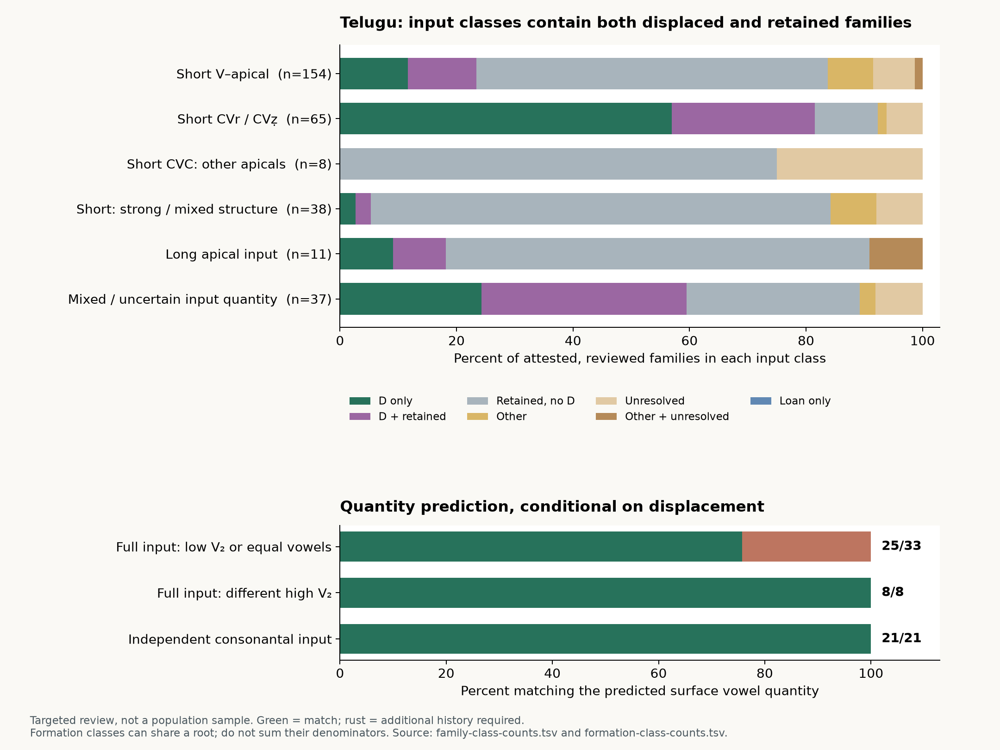

# Telugu metathesis in comparative Dravidian perspective

*A quantitative, etymon-by-etymon investigation of the Jambu snapshot. Analysis frozen 9 September 2026; narrative written after the comparative annotation and count audit.*

Telugu metathesis has a coherent historical centre: a postvocalic apical consonant acquires an earlier position, creating either a new word-initial consonant or an initial cluster. The comparative evidence establishes this direction in numerous individual families. It does **not** establish an exceptionless rule selecting every affected word from its segmental input. The strongest conditioning concerns the shape of the resulting formation, especially the interaction of vowel quality, vowel deletion, contraction and consonantal suffixes. Application itself remains sensitive to lexical and morphological history, with genuine retentions inside the proposed environments.

Three distinctions change the interpretation of the evidence. First, a displaced-looking modern form can preserve an earlier metathesis, result from ordinary internal assimilation, contain an added consonant, or belong to another etymology. Second, a root and its derivatives need not share the same immediate input: a long bare root may have an independently short derivative, and a vowel-bearing stem may coexist with a consonantal one. Third, similar outcomes in related languages need not be the same historical event. Older South-Central apical displacement, later Kuvi sonorant reordering, Kondh stem–suffix stop alternations and sporadic changes elsewhere require separate accounts.

The reviewed frame contains **409 DEDR entries**, reduced to **403 primary root families**. Telugu has supported displacement-family evidence in **117 of 313 families with informative D/R outcomes**, or **117 of 370 attested, reviewed families** when ambiguous and other developments remain in the denominator. These are **37.4%** and **31.6%**, respectively. Neither is a language-wide metathesis rate: the review deliberately includes the previously identified Telugu cluster candidates and selected comparative controls. Of the 117 D-bearing Telugu families, **51 also contain retained-order evidence**. An analysis consisting only of positive examples would obscure that coexistence.

## Evidence, units and the limits of the denominator

The extraction starts from the frozen CLDF forms, edges, language, dialect and source tables. The input manifest hashes ten files; the source database has 677,797 form records and 357,003 edges, and the research extraction preserves 162,451 records relevant to its Dravidian/etymological selection. Attested language IDs are distinguished from reconstructed-language IDs using metadata, not spelling heuristics: Pengo and Parji are languages, not proto-language labels. Old Telugu is combined with Telugu, Old Malayalam with Malayalam, and the historical Kannada label `pampa` with Kannada for the principal family counts. The uncombined source labels remain in the evidence appendix. The resulting 43 attestation groups are not 43 statistically independent languages or dialect samples.

Each reviewed entry has a manually reasoned reconstruction, a direction argument, a proposed derivation, an input class, language-specific outcomes and exception notes. The [complete casebook](casebook.html) contains all 409 analyses; [cited-evidence.tsv](cited-evidence.tsv) contains 9,823 evidence links, comprising 9,742 distinct cited form IDs and 81 research-only source observations. The [raw-record appendix](complete-reviewed-records.tsv) preserves all 17,558 records in reviewed groups, explicitly marking records that were not individually cited/adjudicated. An entry-level comparative review is not a claim to have independently checked every uncited derivative or every source page.

The outcome codes answer a particular historical question. **D** means a supported displacement-family development; it does not by itself prove literal segment exchange rather than assimilation plus vowel loss. **R** means retention of the target initial order, allowing unrelated changes elsewhere in the word. **O** is another development; **A** is an unresolved analysis; **B** is borrowing. A language–family cell can contain several flags. In the disjoint tables below, “D only” means D with no R, not the absence of every uncertain subsidiary form. Mixed D/R cells are shown separately. Other-only, uncertain-only, their overlap, and loan-only cells are distinct from missing attestations and attested-but-unreviewed material.

Counting follows root families, not records, dictionary editions, plural forms or causative derivatives. Six primary mergers concern closely related or duplicate lexical families, including size/measure, stroke/comb and the two demonstrative paradigms. A second partition applies 35 explicitly documented possible mergers, yielding 365 families. It is a sensitivity analysis, not a collection of accepted new etymologies. Under it, Telugu becomes **113/286** on the D/R denominator and **113/334** on the attested-reviewed denominator: **39.5%** and **33.8%**. The central conclusion survives the merger choices. Every table cell can be reconstructed from [family-count-membership.tsv](family-count-membership.tsv); merger reasons are in [family-merge-sensitivity-proposals.tsv](family-merge-sensitivity-proposals.tsv).

The review includes all **116 previously identified Telugu initial-cluster candidate groups**. It does not exhaust the database. Of 5,548 DEDR groups, 5,139 remain outside the detailed casebook; of 2,701 Telugu-bearing DEDR groups, 375 were reviewed and 2,326 remain. An independent, deliberately inclusive screen of non-Telugu full forms found 3,489 candidate groups; 388 are reviewed and 3,101 remain pending. These screen matches are not verified reconstructed inputs. The exact remaining IDs are exported in [remaining-dedr-groups.tsv](remaining-dedr-groups.tsv) and [pending-input-screen.tsv](pending-input-screen.tsv). Unreviewed groups never supply negative votes.

## Reconstructing the earlier order

No modern language is assumed to preserve the ancestral sequence. Direction is strongest where several branches retain the same segment order, where matching morphology survives, and where the proposed innovation agrees with independently established correspondences. Telugu itself sometimes preserves a useful full/cluster pair. Those internal pairs are corroboration, not permission to project every full Telugu form unchanged into the proto-language.

Consider *mortar*, [DEDR651](casebook.html#d651). Tamil and Malayalam **ural**, Kannada **oral**, and Telugu **rōlu** support an earlier vowel–rhotic–vowel–lateral formation. A conventional representation is *ur-al > or-al > rōl*. A literal exchange account inserts *roal* before coalescence; an assimilation-and-loss account changes the second vowel toward the first and removes the first syllabic nucleus. The full comparanda establish the older order and low vowel much more securely than they establish either invisible phonetic intermediate. Reverse reconstruction would require repeated vowel insertion and corresponding rearrangement across the full-form branches.

The consonant-initial *stump* family, [4971](casebook.html#d4971), is unusually informative. Tamil and Malayalam **muraṭu**, Kannada **moraḍu**, and Telugu **moraḍu** independently support *mor-aḍ*. Telugu also has **mrōḍu**; Kui **mrōjo** provides a related cluster outcome. The sequence *mor-aḍ > mrōḍ* accounts for both the change in order and the long vowel, with separate stop developments in Kui. Crucially, Telugu **moraḍu** itself includes the stump meaning. The coexistence cannot be made deterministic by assigning “stump” and “rough” to perfectly separate outcome classes.

The *day/sun* family, [4559](casebook.html#d4559), supplies a different input. Tamil **poẓutu**, Kannada **poẓtu/portu**, and Gondi **poṛdu** establish the earlier full and consonantal series. Telugu **proddu** is compatible with *poẓ-t > pẓot > proddu*, with separate strengthening/voicing. **Poddu** can follow cluster-r loss. But Kannada **portu : pottu** independently demonstrates direct medial assimilation, so an eastern **pod-** without a cluster witness is not automatically concealed metathesis. The database's compound head *ap-pōẓ* is not the immediate ancestor of every time word; Telugu **appuḍu/ippuḍu/eppuḍu** require their own deictic-compound history.

Likewise, **marbu : mrabbu** ‘darkness/cloud’ [4728](casebook.html#d4728) and **barduku : braduku** ‘live’ [5372](casebook.html#d5372) provide independently supported medial clusters. The latter is especially important for input classification. Tamil **vāẓ** and Kannada **bāẓ** establish a long bare root, but Kannada **barduku/barduŋku** establishes a short expanded derivative. Telugu **braduku/bratuku** can reorder that derivative without an invented short allomorph. This is a legitimate morphological distinction because the full short formation exists independently; the same move is not licensed for every long-root exception.

## What is conditioned in Telugu?

The traditional analysis distinguishes vowel-initial apical promotion from cluster formation in consonant-initial roots. It also distinguishes identical or low second vowels from different high second vowels and consonantal formations. Krishnamurti's formal rules, historical mechanism and discussion of lexical diffusion appear in separate parts of his synthesis; they should not be collapsed into a single fully specified phonetic law. The present classes preserve C1, V1 quantity and quality, C2 identity and structure, V2, grammatical category and independently supported formative boundaries. Unknown values remain unknown. [Krishnamurti2003, pp.157–162](https://tamilnavarasam.in/Books/Others/The_dravidian_languages.PDF).

The principal Telugu domains are as follows. “Other/A/B” combines the displayed disjoint non-D/R cells only to keep this table compact; the full count file separates all three and the O+A overlap. “Frame” includes the missing families in that input class. There are no attested-but-unreviewed Telugu cells within these reviewed families.

{{DOMAIN_TABLE}}

The high cluster-domain fraction cannot be compared directly with the vowel-initial fraction as an unbiased difference in historical susceptibility. The cluster sweep was selected partly from Telugu outcomes; the vowel-initial review contains a broader negative-control series. The relevant robust finding is the existence of both outcomes **within** independently defined classes. The broad hypothesis that all short singleton apicals in the narrow classical domains change encounters retained evidence in **134 families**, is consistent with D and no R in **55**, and is nondecisive in **46**. This is an entry-wide falsification of obligatory application, not a fitted probability model or a refutation of every possible finer historical condition.

Low V2 does not by itself select affected words. Among short vowel-initial singleton-apical families assigned an independently supported low-a class, D occurs in **18/48 D/R-informative families**, or **18/54 attested-reviewed families**; ten are mixed D/R. High-i and high-u classes give **3/9** and **3/19** on the D/R denominator, respectively. These are descriptive comparisons with different ascertainment and lexical coverage. Within the low-a consonant-initial r/ẓ class, **14/17** informative families bear D, but one also retains R and three have R without D. A following low vowel therefore helps explain the resulting vowel without being a sufficient application condition.

Segment identity matters. The vowel-initial review separately records rhotics, alveolars, laterals, retroflex stops and the reconstructed retroflex approximant ẓ. It does not merge them because several eventually become **r** or **d**. The resulting Telugu reflexes can erase precisely the contrast needed to decide an etymology. In consonant-initial words, the robust native cluster series centres on rhotic/ẓ inputs; purported lateral, nasal or stop examples require closer comparison. The complete [joint input-class tables](family-class-counts.tsv) provide Domain×V2, Domain×C2 and Domain×V1 counts for every attestation group, alongside C1 identity and grammatical-category counts.

Quantity is more tractable when tested on formations whose input is independently supported. The audit distinguishes **full** matching vowel-bearing formations, independently supported **cluster** formations, **mixed** competing inputs and **conditional** inputs whose exact suffix or vowel is not established. Every Telugu D-bearing primary family has at least one formation audit row; that coverage does not make every row strictly testable.

{{QUANTITY_TABLE}}

The proportions are conditional on displacement and on the specified input tier. A family can occur in more than one tier or formative class; these denominators must not be added. No class was reconstructed backwards from a desired long or short output. The table supports a useful conditional generalization: matched full low/equal-vowel formations commonly yield length, and the audited different-high-vowel and consonantal formations yield short vowels. It does not establish an exceptionless full-input-to-modern-output law.

Schematically, for an independently short root in an eligible apical domain, the traditional quantity hypotheses distinguish three inputs. A full *(C)V₁R-V₂-X* with low or identical V₂ can give *(C)R-V̄-X* through displacement and contraction; a full formation with a different high V₂ can lose that vowel and give short *(C)R-V-X*; an independently consonantal *(C)V₁R-C* can give short *(C)R-V₁-C* without contraction. Here R stands for the input apical at the reordering stage, before its later language-specific reflex, and X leaves further morphology unspecified. These are conditional historical predictions, not rules authorizing an unattested V₂. Earlier *i/u > e/o* before low *a* must also be distinguished from the later Kui–Kuvi lowering of long mid vowels discussed below.

The eight short outcomes in the full-input long-prediction class deserve individual explanations:

| Family | Independently supported input and Telugu outcome | What could explain the mismatch? |
| --- | --- | --- |
| [474 two](casebook.html#d474) | *ir-aṇṭ*, **reṇḍu** | Earlier long *rēṇḍ* followed by shortening before the cluster is plausible. A source-level early rēṇḍ reading is relevant, but its palaeographic confirmation remains incomplete. Human **iruvuru** is a different, independently high-u formation. |
| [694 deer](casebook.html#d694) | Parji **uṛup**, Telugu **duppi** | Early medial-vowel deletion or later shortening with strengthening could intervene. A short output alone cannot establish either stage. |
| [1787 blind](casebook.html#d1787) | Full *kur-uṭ*, **gruḍḍi/gruḍḍu** | Tulu/Kota consonantal **kurḍ** independently supports a syncope branch. Its existence makes *kurḍ > gruḍḍ* credible but does not date Telugu syncope. |
| [4993 sink](casebook.html#d4993) | Full *muẓ-uŋk*, **bruŋgu** | Consonantal comparanda support earlier syncope as an alternative to contraction plus shortening. Initial m>b is a separate development. |
| [1767 bend](casebook.html#d1767) | Tamil **kuraŋku**, Telugu **kruŋgu** | Full low-a and consonantal branches coexist comparatively; the consonantal route can account for short u. The low-a full form must nevertheless remain visible in the audit. |
| [2687 shrink](casebook.html#d2687) | Tamil **curukku**, Telugu **srukku** | Kannada **surku** supports a consonantal stage; c>s and strengthening are separate. No evidence requires contracting uu first. |
| [4312 worm](casebook.html#d4312) | Telugu **puruvu**, **pruvvu** | **Purvu** and Konda **piṛvu** supply consonantal alternatives. Both full and clustered retained forms prevent the output from choosing its own ancestor. |
| [4975 perish](casebook.html#d4975) | Tamil **muruŋku**, Telugu **bruŋgu** | Medial syncope and m>b are plausible; a matching dated intermediate is lacking. This death/break family is not automatically identical with the homophonous sink family4993. |

There are further quantity problems outside the strict table. **Lā̃cu** ‘desire’ [301](casebook.html#d301) has a high-i base but an insufficiently matched nasal-palatal formation. **Ḍekku** ‘stumble’ [437](casebook.html#d437) has competing low-vowel and strong-cluster comparisons. **Prēgu** ‘intestine’ [4193](casebook.html#d4193), **prō̃gu** ‘earring’ [4545](casebook.html#d4545), and **mrē̃gu** ‘smear’ [5082](casebook.html#d5082) do not independently supply the low-a suffix that would conveniently predict their long vowels. **Vrīlu** ‘open’ [5411](casebook.html#d5411) must not validate a same-vowel rule through the very *-il* reconstruction that the earlier analysis describes as otherwise unattested. [Krishnamurti1961, pp.61–68, especially p.67 §1.156; notes on pp.129–131](https://books.google.com/books?id=56PXtopfoscC&pg=PA51).

## Morphology explains some contrasts, but cannot absorb every exception

Several distinctions are independently motivated and historically useful. Telugu **tirugu** beside **trikku/trippu** ‘turn’ [3246](casebook.html#d3246) corresponds to independently weak and strong velar/labial formations. **Lōna** ‘inside’ versus **ullamu** ‘mind’ [698](casebook.html#d698) contrasts a singleton locative formation with a separately attested geminate noun. **Ēḍu** ‘seven’ versus **ḍebbadi** ‘seventy’ [910](casebook.html#d910) involves a long free numeral and an independently short compound allomorph. **Kīḍupaḍu** and **krinda** [1619](casebook.html#d1619) similarly require long and short formations, not a single root string mechanically transformed in every context.

The *destroy* and *descend* verbs illustrate why formative consonants matter. Labial nonpast and dental/palatal past formations can become separate lexical stems; a modern velar, nasal or doubled stop need not have been an unanalyzable root-final consonant when displacement occurred. Comparative morphology can establish this distinction without counting every derivative as another sound-change event. [Krishnamurti2003, pp.188–195](https://tamilnavarasam.in/Books/Others/The_dravidian_languages.PDF).

Other proposed distinctions are not sufficient. **Aḍagu/aḍãgu** ‘submit’ and **ḍā̃gu/dā̃gu** ‘hide’ [63](casebook.html#d63) share the broad low-vowel nasal formation. **Alavi** ‘measure’ and **lāvu** ‘size/strength’ [291/295](casebook.html#d291) preserve divergence within one primary family. **Tarcu** and **traccu** ‘churn’ [3095](casebook.html#d3095) both belong to a consonantal formation. Low-a retained **ara** ‘half’ [229](casebook.html#d229), **eravu** ‘borrow’ [472](casebook.html#d472) and **era** ‘prey’ [490](casebook.html#d490) remain controls. Semantic specialization may accompany the split, but observing different meanings after a change does not prove that those meanings conditioned it.

Nor do compound boundaries uniformly block or trigger displacement. Support-stone/anvil [86](casebook.html#d86) has a relevant boundary; the writing/scratching family [5263](casebook.html#d5263) contrasts low-ay and high-i derivatives; the time family has deictic compounds. Their individual morphological histories matter more than a binary “compound” label. Modern part-of-speech labels are preserved and tabulated, but they cannot always be projected back to the period of change. The data do not support an independently validated universal noun/verb split.

The pronominal and quotative cases belong in the investigation but outside the narrow lexical-apical rule. Telugu **adi : dāni-** and **idi : dīni-** [1/410](casebook.html#d1) require oblique morphology and possible analogical leveling. An apparent old **dēni** is not automatically an earlier proximal stage: Sastri treats the relevant forms as interrogative. The *say* paradigm [868](casebook.html#d868) includes **anan : nān**, **anaka : nāka**, but also short **anaru : naru**. Nasals participate in this specific grammatical history; that does not license nasal movement in every lexical *Vn* root. [Sastri1969, pp.72,178,184](https://archive.org/details/in.ernet.dli.2015.169957).

Krishnamurti's stress proposal supplies a possible phonetic mechanism. He compares Araku Konda **sarás, marán** with Sova **srāsu, mrānu**, and proposes assimilation toward the stressed second syllable followed by loss of the first nucleus. Such dialect contrasts help motivate the account, but do not constitute a dated ancestral sequence. The database lacks consistently comparable stress annotations, so assigning invisible stress according to the observed outcome would merely disguise an exception as a condition. The exact phonetic mechanism remains less securely established than the direction of the historical change. [Krishnamurti2003, p.161, note16](https://tamilnavarasam.in/Books/Others/The_dravidian_languages.PDF).

## Relative chronology and concealed metathesis

The clearest chronological result concerns *destroy* [277](casebook.html#d277). Sastri's inscription9, attributed to the first quarter of the seventh century, contains initial **ḻaccinavānṟu**; the independent Nalajanampāḍu example is attributed to 670–680. The current DHARMA readings likewise have initial **ḻ**, where an earlier edition sometimes read **ḍ**. Under the accepted readings, the displacement of the apical precedes its later Telugu stop outcome. This is materially better evidence than inferring the entire sequence from modern **d-**. [Sastri1969, pp.285,291–292](https://archive.org/details/in.ernet.dli.2015.169957); [DHARMA00099, line3](https://dharmalekha.info/texts/INSTelugu00099); [DHARMA00026, lines18–21](https://dharmalekha.info/texts/INSTelugu00026).

An inscription attributed to 890 contains **ḻassi** alongside **aḻisina** and **aḻiputa**. Those are different formations, so coexistence is evidence for lexical/morphological persistence, not automatically free variation in one identical environment. If the palatal **cc** continues a front-vowel-conditioned dental sequence, its formation must precede loss of the conditioning **i**. The relative order is therefore more secure than an absolute date for the whole sound change. Editorial ḻ/ḍ disagreement is not converted into two ancient dialects. [Sastri1969, pp.310–311,350](https://archive.org/details/in.ernet.dli.2015.169957); [Krishnamurti2003, p.195](https://tamilnavarasam.in/Books/Others/The_dravidian_languages.PDF).

The *below* family [1619](casebook.html#d1619) gives a different chronological interaction. In *kiẓ-nd > krinda*, displacement removes the front vowel from immediate contact with the initial velar. Krishnamurti uses the surviving **k** to place this change before Telugu velar palatalization. Later **krinda > kinda** can remove the cluster while leaving the unpalatalized consonant as a historical trace. Tamil's palatalization has different apical/retroflex conditioning, so the comparison cannot simply be reduced to “Tamil is conservative.” This test cannot be extended to every unpalatalized velar: Krishnamurti also identifies earlier voicing and echo-word morphology as independent blockers. [Krishnamurti2003, p.128, Rule14 and discussion](https://tamilnavarasam.in/Books/Others/The_dravidian_languages.PDF).

Other paired forms expose concealment directly: **krotta : kotta** ‘new’ [2149](casebook.html#d2149), **krovvu : kovvu** ‘fat’ [2146](casebook.html#d2146), **mrānu : mānu** ‘tree’ [4711](casebook.html#d4711), **pratti : patti** ‘cotton’ [3976](casebook.html#d3976), **vrēlu : vēlu** ‘finger’ [5409](casebook.html#d5409), and **travvu : tavvu** ‘dig’ [3122](casebook.html#d3122). Yet **korbu > kobbu** in Kannada, or **portu > pottu**, supplies a competing internal-assimilation route for superficially similar reductions. A modern r-less reflex without independent cluster evidence remains uncertain when both histories are possible.

The initial **b** in the two **bruŋgu** families also needs its own explanation. It cannot be generated by a general Telugu *m > b* before r, since **mrānu** ‘tree’, **mriŋgu** ‘swallow’ [4866](casebook.html#d4866), and **mrukku** ‘become mouldy’ [5007](casebook.html#d5007) preserve m. A narrower phonetic history or analogical spread among similar verbs is possible, but the present evidence does not establish either. This uncertainty does not reverse the comparative evidence for earlier vowel–apical order.

Initial-cluster simplification is also language- and consonant-dependent. Eastern **lēnj-** ‘moon’ can be compared with full **nelan-/nelenj-**, while Telugu **nela** retains the earlier initial order [3754](casebook.html#d3754). The conventional eastern path loses the first consonant of *nl-*. Telugu usually loses cluster-r in the well-attested pairs above, but **vrāyu > rāyu** ‘write’ [5263](casebook.html#d5263) loses the first member instead. Neither language-family slogan substitutes for an etymon's particular consonants. [Krishnamurti2003, pp.158–162](https://tamilnavarasam.in/Books/Others/The_dravidian_languages.PDF).

Several tempting early dates require restraint. The Peda-Vegi Sanskrit charter's **prāluragrāme** attests a place-name, not a demonstrated common-noun derivation; its written regnal year and estimated absolute date have different evidential status. In the young/calf family [513](casebook.html#d513), an editor's preference for **ḷēnṟu** partly uses metathesis theory to supply length, so it cannot independently confirm that length. The alleged seventh-century locative **oḷana** [698](casebook.html#d698) may rest on a superseded reading now interpreted as **ēḷan** ‘ruling’. These records remain visible with their qualifications. [DHARMA Peda-Vegi edition](https://dharmalekha.info/texts/INSEIAD00166); [DHARMA00040 apparatus](https://dharmalekha.info/texts/INSTelugu00040); [DHARMA00099](https://dharmalekha.info/texts/INSTelugu00099).

Sastri distinguishes the old native process from later literary doublets and sporadic loan-word changes. The surviving doublets do not independently date continued productivity; nor does a late Sanskrit-derived cluster reversal. The **druggādēvi** cited in a Lakshmipuram inscription attributed to c.681 and the Ganj example dated1290 are different monuments. The [historical appendix](historical-evidence.tsv) keeps each source, date status, reading and inference separate. [Sastri1969, pp.72,74,294](https://archive.org/details/in.ernet.dli.2015.169957); [DHARMA00101](https://dharmalekha.info/texts/INSTelugu00101).

## Distribution across Dravidian: inheritance, renewed change and contact

The following principal comparisons use the same reviewed root frame, but each language has different attestation and review coverage. D includes the broader supported displacement-family histories described above. The zero values in other languages do not assert that those languages lack every kind of metathesis: several different processes are annotated separately.

{{LANGUAGE_TABLE}}

Direct pairwise comparisons further restrict the denominator to families with D/R evidence in **both** languages. Telugu and Kui share D-bearing evidence in **38/91** such families; Telugu and Kuvi in **29/93**; Telugu and Konda in **22/113**. Mixed cells remain identifiable. In the Telugu–Kui comparison, eighteen families have Kui D while Telugu has R without D, six have the reverse pattern, and twenty-nine have R without D in both. This establishes substantial but incomplete lexical overlap. It cannot by itself identify a phylogenetic node, count historical events or demonstrate contact. [Pairwise counts](pairwise-language-counts.tsv) and [membership](pairwise-language-membership.tsv).

Shared South-Central history is most plausible where more than a cluster shape agrees: compare the low-vowel *hide* family63, the numeral474, and matching apical correspondences in the full and displaced forms. Krishnamurti explicitly proposes an inherited process that continued after subgroup splits, with lexical diffusion and later expansion of its segmental domain. The present review is compatible with a shared historical background and requires substantial subsequent language-specific development. It does not uniquely identify which individual words changed before divergence, independently reconstruct the complete proto-language distribution, or replicate his earlier lexical matrix. [Krishnamurti2003, pp.157–162](https://tamilnavarasam.in/Books/Others/The_dravidian_languages.PDF).

The strongest argument against one completed, exceptionless proto-event is the combination of mismatched lexical incidence, changed domain and derivative-specific outcomes. Telugu preserves **nela** where eastern languages show the moon development; it retains ordinary nasal-root order where Kuvi changes long nasal plurals; a source's full and clustered forms may belong to different dialects. Corresponding stems can have different formative vowels or suffixes. An inherited process that was renewed after divergence is compatible with this evidence. Whether a particular shared word changed once before divergence or more than once afterwards must be decided from its morphology and chronology, not from the overall overlap fraction.

Contact is demonstrable in some cases and merely possible in others. The source explicitly labels Gondi **mabbu** ‘cloud’ as Telugu-derived [4728](casebook.html#d4728), and several Kolami/Naikri/Parji comparisons are treated as early Telugu loans in the comparative literature. Such records remain B rather than independent innovations. Early recipient **ḍ-** can be chronologically informative where Telugu later has **d-**, but a shared unusual initial is not sufficient on its own: the native correspondence system, distribution, donor diagnostics and source attribution still matter. [Krishnamurti2003, pp.107,162](https://tamilnavarasam.in/Books/Others/The_dravidian_languages.PDF).

Plant, crop and implement names warrant particular attention to transmission, without automatically being classified as loans. **Pratti** ‘cotton’, **prēmu/prabba** ‘rattan’, **krānugu** ‘Pongamia’ and **prōlu** ‘town’ have useful comparative order evidence and unresolved layers of diffusion or morphology. Conversely, a known loan such as **trāsu/tarāsu** ‘balance’ can undergo a local reordering without proving an inherited Dravidian sound law. Borrowing and subsequent metathesis are compatible histories; the analysis must identify which part is supported.

Krishnamurti's proposed early Kannada origin for some Telugu voiced-geminate formations is a more specific contact hypothesis. The pushing family [3340](casebook.html#d3340) contains Telugu **drobbu/dobbu**, Kannada **dobbu/ḍobbu**, Tulu **dobbu**, and Naikri **ḍʰobb**. This regional distribution makes transmission worth considering, but shared **bb** and approximate meaning do not independently identify the donor, its date or the immediate rhotic input. The proposal remains conditional for this family and for **sraggu** ‘slip’ [2360](casebook.html#d2360). It is not used to remove all voiced-geminate residuals from the native comparison. [Krishnamurti1961, pp.65–66 §1.153](https://books.google.com/books?id=56PXtopfoscC&pg=PA65).

Brahui provides a useful independent comparison. Its **trikking** beside southern **tirakku** [3244](casebook.html#d3244) preserves the first vowel **i** rather than simply losing it and retaining the second **a**. That makes straightforward aphaeresis inadequate for this comparison. But the short outcome does not match an unqualified Telugu-style low-a contraction prediction. Brahui also retains **pirɣẖing** ‘twist’ [4177](casebook.html#d4177) despite a consonantal continuation. The reviewed set therefore offers evidence for geographically separate reordering with different conditioning, not a shared Telugu–Brahui innovation. No word-specific contact route between them is established. [Subrahmanyam1983, pp.244–245](https://archive.org/details/SubrahmanyamDravidianComparativePhonology1983); [Emeneau1997, especially p.445](https://doi.org/10.1017/S0041977X00032481).

## Later Kuvi changes and the Kui–Kuvi vowel problem

Kuvi's long nasal formations are not simply additional examples of the old Telugu short-vowel nonnasal domain. The louse family [4449](casebook.html#d4449) has source-labeled **pēnu : pṇēka** in one series and **pēnu : pēnka** in another. The plural supplies a concrete consonantal input *pēn-ka*, and the older full-order comparison is independently available. The source/dialect distinction must be preserved: it is not automatically free variation within one speaker. Long **pēn-** remains long; no unattested low formative vowel is needed.

The god [4438](casebook.html#d4438) and fish [4885](casebook.html#d4885) paradigms provide related comparisons, but they are different roots. In fish, singular **mṇīnu** contains two nasal positions and therefore cannot be obtained by literally moving the sole nasal in **mīnu** while leaving it in place. Plural-to-singular analogy or nasal excrescence is a concrete alternative. The eel family [4737](casebook.html#d4737) is different again: independent full comparanda point to a lateral before the later nasal development. Its outcome cannot establish an originally nasal input.

These observations support a later Kuvi extension of the participating sonorants and input shapes. Hume discusses it through distributional and perceptual constraints. The lexical evidence establishes the forms and their contrasts; it does not directly measure ancient perception. Her reported counts of 98 Kui and 59 Kuvi changed forms, plus 19/23 variable forms, and 1,535/736 open/closed syllable tokens belong to different datasets and units. They must not be compared numerically with the present deduplicated family denominators. [Hume2004, pp.225–226, example18 and note16](https://doi.org/10.1353/lan.2004.0083).

The subsequent Kui–Kuvi lowering problem also needs a separate audit. Krishnamurti's 1980 paper distinguishes vowels produced in different historical environments. The printed positive-example list contains nine Kui-only items, one Kuvi-only, six shared by Kui and Kuvi, and two shared also with Manda. This gives **17/18 selected examples for Kui**, not eighteen; the omitted Kui item is explicitly unattested, so the known-attestation-adjusted ratio is **17/17**, not a retention exception. Kuvi has **9/18** listed lowered examples, Manda **2/18**. These are a recount of a selected illustration list, not estimated innovation rates. [Krishnamurti1980, p.499](https://doi.org/10.3765/bls.v6i0.2099).

Testing the historical claim is harder than correcting the arithmetic. Only a subset independently supplies the exact low-vowel formation, including salt [2674](casebook.html#d2674), name [4410](casebook.html#d4410), and rope [4976](casebook.html#d4976). *Bone* [4418](casebook.html#d4418) has a relevant full **peṛen** comparison, not a demonstrated second *a*. Rice [3982](casebook.html#d3982) and chironji [2628](casebook.html#d2628) have unresolved formative vocalism. The descend comparison [516](casebook.html#d516) competes with the different etymology2456. The split between *spread*3949 and *sell*4536 is therefore retained as a substantive hypothesis and tested under a possible family merger, rather than allowing the observed vowels to guarantee two independent roots.

The *skin* family [3559](casebook.html#d3559) is especially important: contraction can produce a long vowel without the target metathesis and without the predicted later lowering. A different contraction chronology is plausible, but is not independently dated. Krishnamurti's proposed account uses an earlier phonetic distinction between long vowels, subsequently merged, rather than a synchronic rule that remembers deleted *a*. The present comparison leaves that chronology plausible and incompletely identified. White-ant [837](casebook.html#d837) **līmpu/lēmpu** beside an e–u input is another unresolved quantity/quality problem. [Krishnamurti1980, especially pp.500–503](https://doi.org/10.3765/bls.v6i0.2099); [complete lowering audit](lowering-source-audit.tsv).

## A different regularity: stem-final velar plus labial suffix

The Kondh languages provide a comparatively explicit morphological alternation: a velar-final stem before a labial formative appears with the consonants in the opposite order. This is not Telugu initial-apical displacement. The screen of **152 records in 123 groups** was completely adjudicated, distinguishing verbal formations, nominal plurals, labial-base controls, editorial fragments and nonlexical search matches. The source-supported family counts are:

{{STOP_TABLE}}

These denominators are the supported inputs found by the literal cluster screen, not all verbs or all opportunities for productive suffixation. The apparent regularity is reinforced by independent paradigms. Winfield distinguishes **lek-pa > lepka** from a **leksa** perfect-participial formation and **sug-ba > subga** from past forms retaining the stem order. Nonvelar controls preserve their own stem–suffix combinations. His **gī-/kī-** vowel stems with strengthened **p** plus **ki** are especially useful: they produce **pk** without an ancestral **kp**. The source-based appendix contains 55 observations, which overlap both one another and the dictionary families and are never pooled as new roots. [Winfield1928, pp.72–75](https://ignca.gov.in/Asi_data/37202.pdf).

The Kuvi **kakpinai** ‘joke’ [DEDR1080](stop-cluster-annotations.tsv) is a possible retained-order challenge to a categorical suffix rule. Another source has a reversed **kap-ki** formation. Source, dialect, meaning and morphological context differ; the original Schulze passage was not obtained. It is therefore neither deleted as a presumed error nor elevated to a decisive sound-law counterexample. Similarly, Kuvi **hūp-ki** ‘spit’ and Manda **kup-ki** ‘fill’ start with labial-final bases; they cannot count as velar–labial exchange merely because their outputs contain **pk**.

Garrett and Blevins propose a historical route through causative replacement, reanalysis, double marking and analogy. The observed paradigms establish the resulting morphological alternation, while the vowel/labial-base controls establish independent sources of **pk**. Together they make an analogical origin viable; they do not uniquely prove every proposed intermediate. A highly regular present-day correspondence can thus coexist with uncertainty over whether the historical origin was phonetic transposition. Hume's manuscript table also misaligns some infinitive versus participial labels relative to Winfield, making source-level morphological checking essential. [Garrett and Blevins2009, §22.4, pp.537–543](https://julietteblevins.ws.gc.cuny.edu/files/2013/04/GarrettBlevins2009d-AnalogicalMorphophonology.pdf); [Hume2002, p.38](https://roa.rutgers.edu/files/546-0902/546-0902-HUME-0-0.PDF).

Other Dravidian processes are represented separately in [other-process-observations.tsv](other-process-observations.tsv). The tooth-stick compound [3986](casebook.html#d3986), segmented through *pal* ‘tooth’ and *kar* ‘stick’, has Gondi **palkār/parkal** and a relevant Parji comparison: compounding precedes an exchange of two liquids, unlike the initial-apical process. Kota glide reordering and the Koṇekor Gadaba **savl-/saluv** paradigm involve different positions and vowel-insertion possibilities. Source-labeled southern aphaeresis, including Tulu full/reduced pairs, cannot be treated as an inherited South-Central event merely because the result begins with a liquid. [Subrahmanyam1983, pp.81–87,225–248](https://archive.org/details/SubrahmanyamDravidianComparativePhonology1983); [Steever2020, Gadaba chapter pp.408–410](https://doi.org/10.4324/9781315722580).

The external Kunha study is also audited rather than absorbed into the main counts. All thirty published Kurux–Kunha pairs are annotated for possible initial/final reversals, consonant exchange, laryngeal movement, vowel deletion, suffix alternation and transcription inconsistency. Several pairs admit nonmetathetic derivations. Contemporary Kurux is not assumed to be Kunha's unchanged ancestor. Kunha is absent from this snapshot's language inventory, and the study's larger elicited dataset is not published as a usable denominator. [Kujur and Dash2025, pp.118–119](https://doi.org/10.25077/ar.12.2.114-124.2025); [pair audit](kunha-published-pair-audit.tsv).

## False positives, unresolved roots and new lexical leads

A particularly clear control is **tuḷḷu : truḷḷu** ‘jump, be proud’ [3364](casebook.html#d3364). Tamil, Malayalam, Kannada, Kodagu and Tulu independently supply the geminate-lateral form without r. Telugu's augmented form retains that lateral and adds r, so simple transposition cannot derive it. Krishnamurti proposes literary hyperstandardization on the model of archaic initial clusters. Segment addition is supported more directly than the proposed social mechanism, and the case does not automatically explain every other extra-r word. [Krishnamurti1961, p.131 note80](https://books.google.com/books?id=56PXtopfoscC&pg=PA131).

Some attractive Telugu clusters fail a basic segment-accounting test. **Krūru** ‘sharp’ [1898](casebook.html#d1898) contains two rhotics; **treḍḍu** ‘ladle’ [3411](casebook.html#d3411) retains the retroflex while adding r; **vrālu** ‘perch/incline’ [5368/5369](casebook.html#d5368) retains the lateral; **vranti** ‘stream/pit’ [5250](casebook.html#d5250) retains nt; **vrēyu** ‘strike/throw’ [5555](casebook.html#d5555) lacks an independently established r-bearing antecedent. Secondary r, analogical extension, fuller lost morphology and borrowing are competing hypotheses. They remain A unless evidence selects a history. Sanskrit **krūra** offers a concrete comparison for1898 because its dictionary senses include hard and sharp, but direct Telugu transmission is still unverified. [Monier-Williams1899, p.322](https://www.sanskrit-lexicon.uni-koeln.de/scans/MWScan/MWScanpdf/mw0322-krIDu.pdf).

Source semantics can be decisive. Old Telugu **mṛ̆ēka** [5087](casebook.html#d5087) is explicitly of unknown meaning: the goat gloss of **mēka** cannot be transferred onto it. **Prāmu** ‘smear’ and Manda **prēmba** [4608](casebook.html#d4608) lack an independent full-order input. Tulu expressive **maramara** versus Telugu **mrālu** ‘drowsy/close eyes’ [4710](casebook.html#d4710) leaves cognacy and suffix morphology unresolved. The plant compound comparison behind **mraŋga** [4716](casebook.html#d4716) has nonmatching morphology and possible transmission; unrelated Badaga home compounds attached to that tree entry are excluded from its cognacy evidence.

Competing roots are not silently combined into a single successful derivation. Telugu **mrō̃gu/mrōyu/mrōvu** ‘sound’ occurs under *mur*4973 and *muẓ*4989; **mruggu** ‘ripen’ under strong *muṟṟ*5017 and long *mūẓ*5046. The order-change interpretation can be plausible while the precise input apical, vowel and suffix remain unresolved. These forms receive A under the competing entries and a merger sensitivity, not two independent D votes. The same policy applies to the cut/break alternatives3305/3339 and several calf, moss and shrinking comparisons. A historically earlier distinctive apical reflex, a matching derivative or a demonstrable analogical paradigm would discriminate the alternatives.

Targeted exploration of unlinked material assessed **18 database records**. Strong additional cognate candidates include two Kurux **pēn** ‘louse’ wordlist records and Kannada-Kurumba **henu**, with quantity and lect-label qualifications. Gondi **mīna** and two Kurumba fish records fit the fish family; star records belong with shine/star unless the deeper fish–shine relationship is independently accepted. Brahui candidates distinguish **pirɣẖing** ‘break’ from superficially similar twist/swell words, and leave the ambiguous day-after and sift candidates unresolved. These are documented leads, not accepted database edits or new independent roots. [Unlinked-candidate annotations](unlinked-candidate-annotations.tsv).

## What is established, and what remains open

The well-supported result is a set of directional histories anchored in full comparative forms, recurrent apical correspondences and, in some cases, attested old clusters. Quantity and morphology divide those histories into meaningful classes. Later loss of r, earlier syncope, apical mergers, palatalization and analogical restructuring can substantially change the modern evidence. The early initial-ḻ destroy forms and the palatalization interaction in **krinda** provide especially useful relative chronology.

A broader inherited South-Central background with subsequent lexical and regional developments is plausible and consistent with the comparative scholarship. Individual shared innovations need stronger evidence than a common **Cr-** outcome; some contacts are source-supported, while many proposed diffusion histories remain unproved. Later Kuvi nasal changes and Kondh suffixal alternations have distinct conditioning. Brahui and the southern aphaeresis comparisons demonstrate why similar surface results should not be treated as one family-wide change.

An exceptionless lexical application law has not been established. The missing information is concrete: dated matched derivatives, independent reconstruction of V2 and suffix consonants, source-level dialect paradigms, better documentation of low/open-mid vowel chronology, and fuller evidence for disputed cognacy and transmission. The pending-ID files identify the substantial remaining lexical work. The review's targeted selection, incomplete source access and uneven attestations prevent population-frequency or phylogenetic estimates. They do not erase the positive comparisons or the independently documented retentions.

The reproducible outputs make those distinctions inspectable. [README.md](README.md) gives the regeneration commands and file map; [SOURCE_ACCESS.md](SOURCE_ACCESS.md) gives precise citations and access limits; [validation.json](validation.json) records the independent arithmetic and linkage checks. The casebook, structured annotations, source evidence, formation tests, all-language class tables, pairwise membership, historical observations and unresolved queues are the complete appendices to this report.
